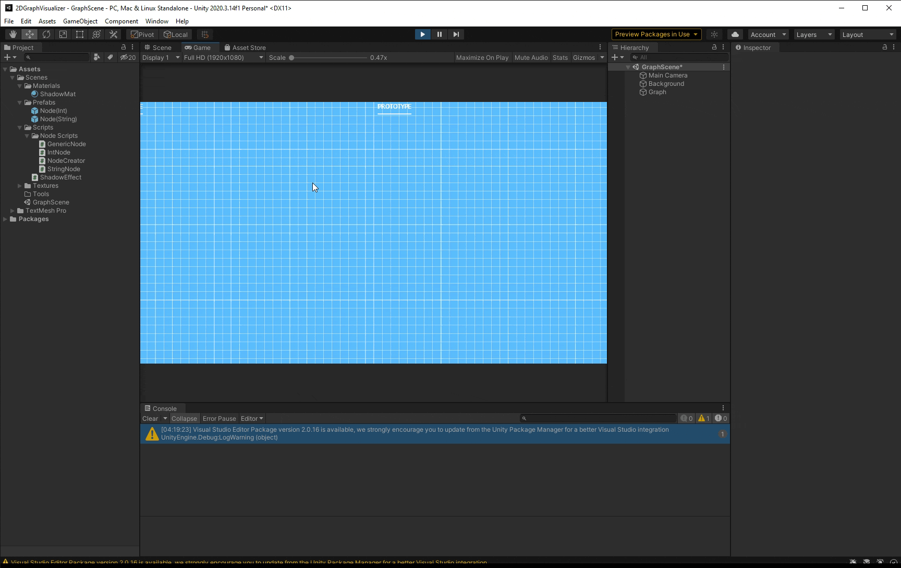
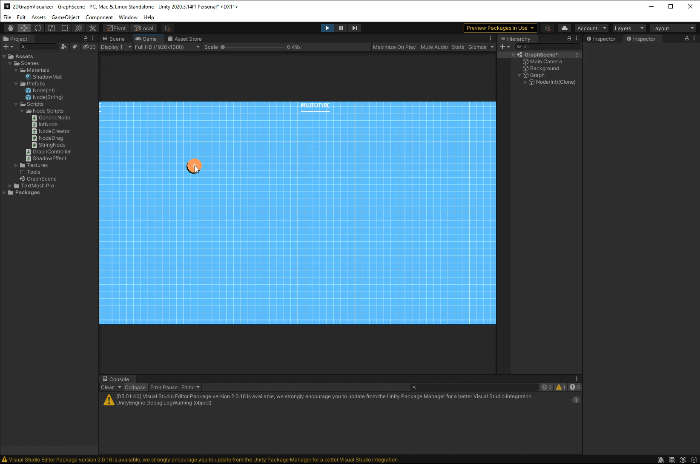

# 2DGraphVisualizer

## WIP

The goal of this project is to develop a visual education tool that allows the user to create custom graphs (or select from pre-existing graphs) and then step through pre-made search and shortest path algorithms in real time and visually depict how each line of code affects graph traversal.

Supported search alorithms are Breadth First Search, Depth First Search, Djikstra, and A*

### Update 1: 
For the initial work done we have a background and ```nodes``` can be placed where ever the user hovers and presses [left-click]

 
### Update 2:
After a bit of trial and error we can now place nodes and, when hovering over a node and pressing [left-click], drag that node around, deletion
of already existing ```nodes``` is also possible when pressing the [D] key while hovered over a ```node```. This is accomplished using GameObject.Destroy() which admittedly may not be the best practice, but as long as all refrences of the gameObject are also removed at the same time, there won't be any access issues.


### Update 3:
Coming back after a little break I decided to get edges working properly. I started with just getting the functionality working for one edge and then built upon that to create a system that allows for multiple edges. These edges move and update every frame, if an edge is not being created. There isn't a performance hit on my system, but this is definitely not an ideal solution. It would be better that I only update edges when a node is being moved, it's a simple fix that I'll add in a bit later, but for now this works.


